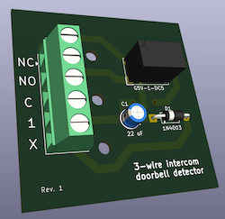
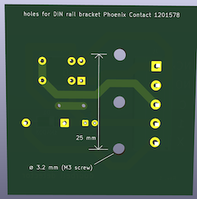

Circuit (KiCad project) to detect door chime or warble tone from a PK543A or similar
apartment intercom amplifier.
To be wired in parallel with apartment intercom.

Inputs: X and 1 from intercom.

Outputs: dry contact relay (normally-open and normally-closed terminals),
e.g. for detection by a Shelly smart switch.

Mounting: three holes for DIN rail mounting bracket Phoenix Contact 1201578.

You can order the PCB from a fabricator such as [OSH Park](https://oshpark.com/)
by uploading the zip of gerber/drill files (see Releases on GitHub).
You can also order it fully assembled from fabricators providing assembly service
by sending them the Bill of Materials (BOM) file along with that zip.

Based on information from [this post by Chris Whong](https://chris-m-whong.medium.com/connecting-an-apartment-door-buzzer-to-a-smarthome-hub-4664cf6a3ce4).
This board provides the same functionality as the discontinued Alpha Communications RY014B.





## Development notes

Panelize with KiKit:

```sh
kikit panelize \
    --layout 'hspace: 0.5mm; vspace: 0.5mm; cols: 2' \
    --tabs 'type: fixed; vcount: 4; hcount: 4' \
    --cuts 'type: mousebites' \
    $(pwd)'/doorbellsensor.kicad_pcb' $(pwd)'/panelized/doorbellsensor_panelized.kicad_pcb'
```
